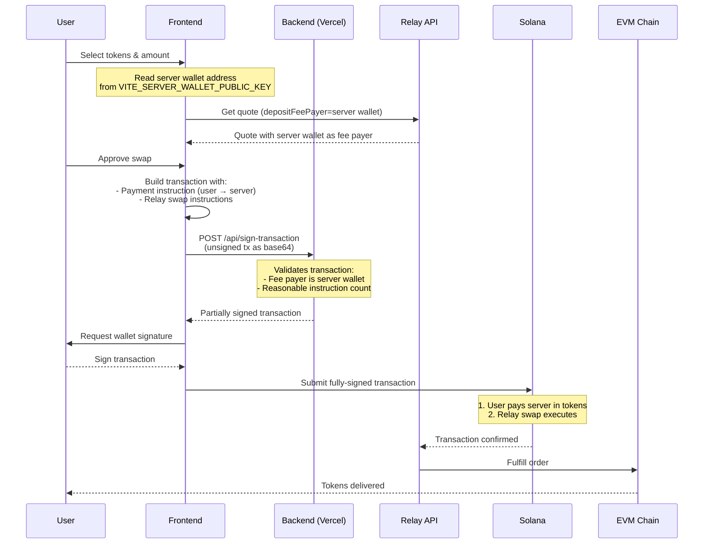

# CoolSwap

Cross-chain swap dApp for swapping Solana SPL tokens to any EVM chain via Relay Protocol with **zero-SOL gas sponsorship**.

## Features

- **Zero-SOL Swaps**: No SOL required in wallet - gas paid in source token
- **Cross-chain**: Swap from Solana (SPL tokens) to Ethereum, Arbitrum, Base, Polygon, and more
- **Gas Sponsorship**: Server wallet pays Solana fees, user reimburses in source token
- **Token-2022 Support**: Handles transfer fee tokens correctly
- **Real-time Quotes**: 30-second validity from Relay Protocol
- **Bridge Abstraction**: `IBridgeProvider` interface allows swapping bridge providers

## Architecture Overview

CoolSwap enables **zero-SOL swaps** where users don't need any SOL in their wallet. Our Vercel backend wallet sponsors all Solana transaction fees, and the user reimburses in their source token.

### High-Level Flow



### Key Concepts

**Zero-SOL Requirement**
- User wallet needs ZERO SOL balance
- Our Vercel backend wallet acts as the Solana transaction fee payer
- User pays gas cost in their source token (e.g., USDC)

**Server-First Signing**
- Backend signs transaction FIRST (as fee payer)
- User signs SECOND
- Prevents users from modifying unsigned transactions to drain server's wallet

**Gas Payment Mechanism**
1. Relay quote includes gas cost in SOL lamports
2. Frontend converts SOL → source token using Pyth oracle
3. Payment instruction transfers tokens from user → server wallet
4. Payment executes as Instruction 0 (before swap)
5. Atomic: both payment and swap succeed or both fail

**Relay Integration**
- Uses Relay's `depositFeePayer` parameter to specify our server wallet as fee payer
- Relay returns transaction data optimized for server-first signing
- Order status tracked via Relay's v3 API (`/intents/status/v3`)

## Tech Stack

- React 18 + TypeScript
- Vite
- Tailwind CSS
- Vitest for testing
- `@solana/web3-compat` (not deprecated web3.js)

## Getting Started

### Prerequisites

- Node.js 18+
- pnpm

### Install

```bash
pnpm install
```

### Development

```bash
pnpm dev
```

Opens at http://localhost:5173

### Build

```bash
pnpm build
```

### Test

```bash
pnpm test
```

### Lint

```bash
pnpm lint
```

## Environment Variables

Copy `.env.example` to `.env` and configure:

```bash
# Frontend
VITE_SOLANA_RPC_URL=https://api.mainnet-beta.solana.com
VITE_HELIUS_API_KEY=your_key_here                    # Optional, for priority fees
VITE_SERVER_WALLET_PUBLIC_KEY=<server-wallet-pubkey> # Server wallet public key
VITE_BACKEND_URL=                                     # Optional, leave empty for local dev

# Backend (Vercel Environment Variables)
SERVER_WALLET_SECRET_KEY=[1,2,3,...]                 # Server wallet private key (JSON array)
```

**Local Development:**
- Leave `VITE_BACKEND_URL` empty - Vite proxies `/api/*` to `localhost:3001`
- Run backend separately: `node api/dev-server.js`
- Generate server wallet: `node api/generate-server-wallet.js`

**Production:**
- Set `VITE_BACKEND_URL` to your Vercel deployment URL
- Vercel automatically deploys `/api` serverless functions
- Set `SERVER_WALLET_SECRET_KEY` in Vercel environment variables

## Project Structure

```
src/
├── components/     # React components (wallet, swap, modals)
├── hooks/          # Custom hooks (useRelaySwapExecution, useOrderStatus)
├── services/
│   ├── bridge/     # RelayProvider with depositFeePayer support
│   ├── gas/        # Gas sponsorship services (legacy, needs cleanup)
│   ├── solana/     # Transaction building, ATA creation
│   └── price/      # Pyth oracle integration for SOL → token conversion
├── context/        # React context (Wallet, Swap, GasSponsor, Bridge)
├── config/         # Chain configs, environment
└── __tests__/      # Test files

api/
├── sign-transaction.js    # Vercel serverless: server-first signing
├── dev-server.js          # Local development server (port 3001)
└── create-server-ata.js   # Helper script for server token accounts
```

## Architecture Details

**Bridge Provider Abstraction**
The app uses an `IBridgeProvider` interface supporting multiple bridges. Currently uses **Relay Protocol** as the primary provider. The abstraction allows swapping providers without changing application code.

**Backend Components** (Vercel Serverless)
- `/api/sign-transaction.js` - Validates and partially signs transactions with server wallet
- `/api/dev-server.js` - Local development server (port 3001)
- `/api/create-server-ata.js` - Helper to create server token accounts (for receiving gas payments)
- `/api/generate-server-wallet.js` - Utility to generate new server wallet keypair

**Key Frontend Services**
- `RelayProvider` - Relay API integration with `depositFeePayer` support
- `useRelaySwapExecution` - Transaction building with server-first signing flow
- `PriceService` - Pyth oracle integration for SOL → token conversion (gas payment calculation)

## License

MIT